<br />
<div align="center">
  <a href="https://github.com/mkokor/weather-buddy">
    
  </a>

  <h3 align="center">Weather Buddy</h3>

  <p align="center">
    An awesome README template to jumpstart your projects!
    <br />
    <a href="https://github.com/mkokor/weather-buddy"><strong>Explore the docs »</strong></a>
    <br />
    <br />
    <a href="https://github.com/mkokor/Best-README-Template">View Demo</a>
    ·
    <a href="https://github.com/mkokor/weather-buddy/issues">Report Bug</a>
    ·
    <a href="https://github.com/mkokor/weather-buddy/issues">Request Feature</a>
  </p>
</div>

# Description

### Splash Screen
<div align="center">
  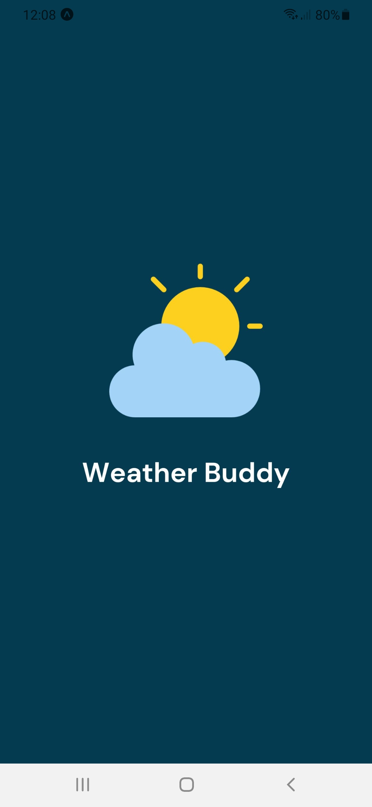
</div>

### Current Weather Screen
<div align="center">
  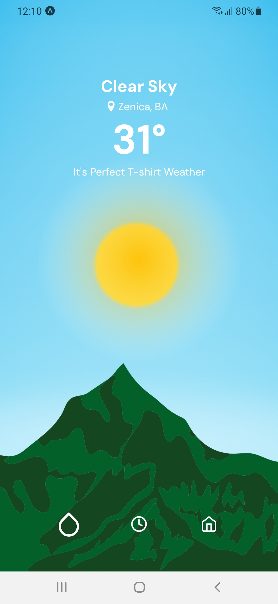
  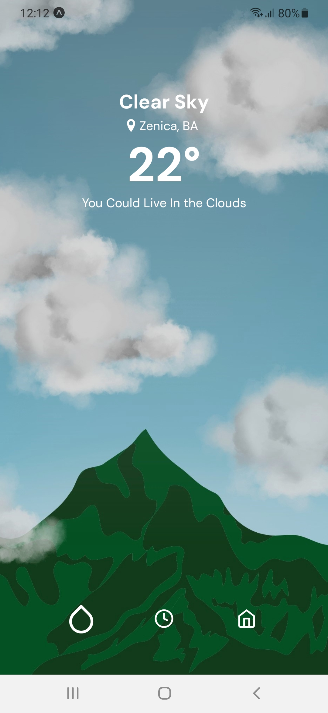
  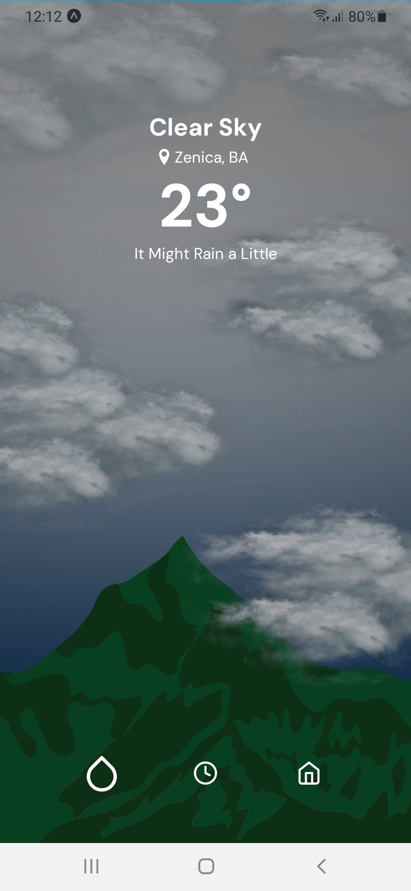
  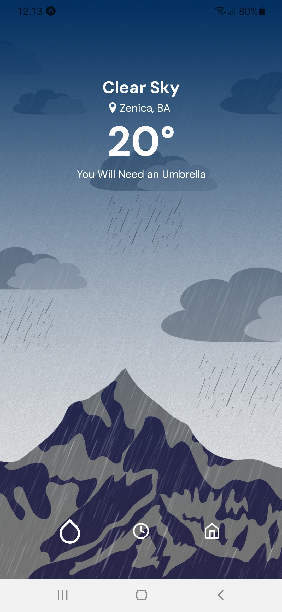
  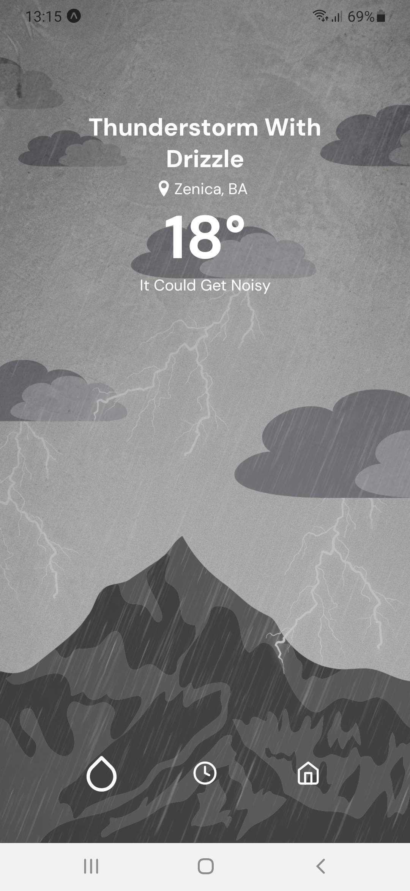
  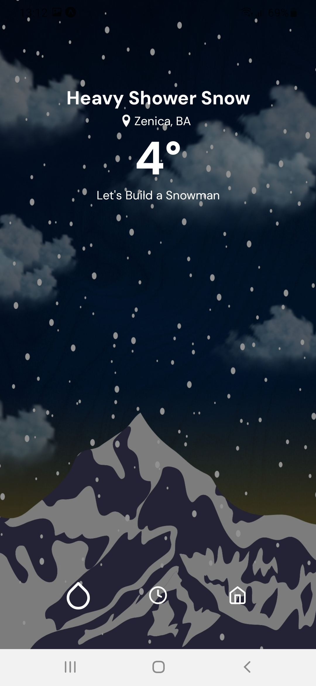
  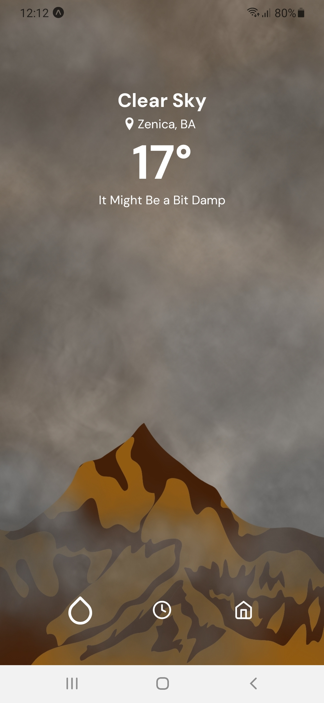
  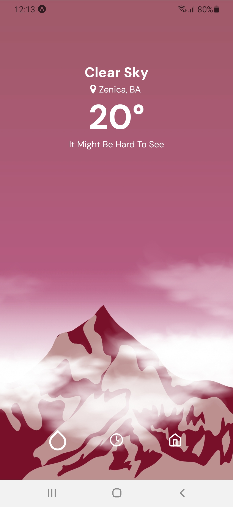
</div>

### Upcoming Weather Screen
<div align="center">
  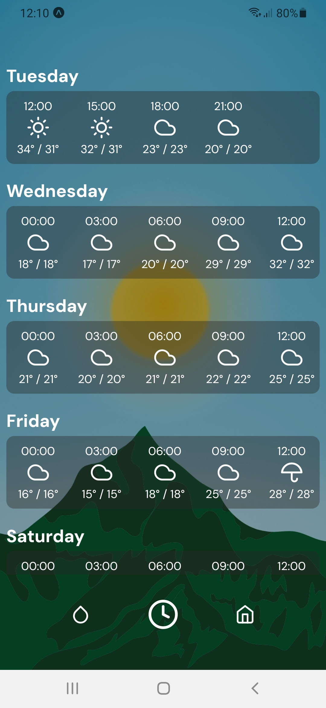
</div>

### Location Info Screen
<div align="center">
  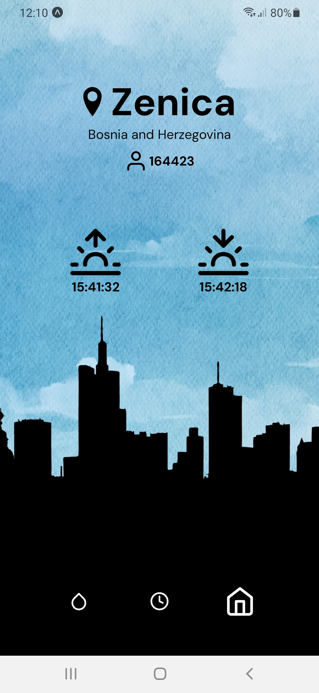
</div>

### Error Screen
<div align="center">
  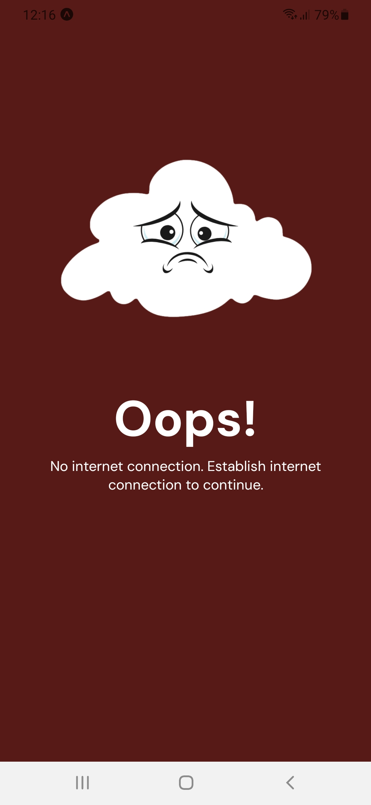
</div>


# Getting Started
<p align="justify">
  Follow the instructions bellow to get local copy up and running.
</p>

## Installation
1. Get a free API key at https://openweathermap.org/
2. Clone the repository
```bash
gh repo clone mkokor/weather-buddy
```
3. Install NPM packages
```bash
npm install
```
4. Enter your API key in .env file
```bash
OPEN_WEATHER_API_KEY="YOUR_API_KEY"
```

## Execution
<p align="justify">
  Run command bellow to start the application.
</p>

```bash
npm start
```

<p align="justify">
  Install <a href="https://expo.dev/client">Expo Go</a> application, and scan the generated QR code.
</p>
